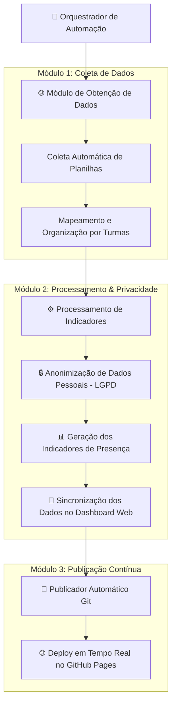

# 🎓 Painel Acadêmico de Acompanhamento de Frequência

Sistema de monitoramento e visualização de frequência acadêmica, com integração para coleta automatizada de planilhas, processamento seguro de dados e publicação em tempo real no **GitHub Pages**.

---

## 📊 Arquitetura do Sistema (Mermaid)



---

## 🛠️ Estrutura do Repositório

```text
.
├── 📄 EXECUTAR_TUDO.bat           # Atalho para execução da automação no Windows
├── 🐍 executar_tudo.py            # Orquestrador principal do fluxo
├── 🐍 web_scraper_excel.py        # Módulo de download e atualização de dados
├── 🐍 generate_dashboard_data.py   # Módulo de processamento e anonimização
├── 🐍 publicar_github_pages.py    # Módulo de publicação automática no GitHub Pages
├── ⚙️ config.json                 # Arquivo de configuração de parâmetros e turmas
├── 🎨 index.html                  # Interface Web Responsiva do Dashboard
├── 🔒 .gitignore                  # Regras de segurança de arquivos sensíveis
├── 🚫 .nojekyll                   # Arquivo de configuração do GitHub Pages
├── 📦 requirements.txt            # Dependências da aplicação
├── 📁 dashboard/                  # Dados consolidados do painel
└── 📁 temp_excels/                # Diretório de armazenamento temporário de dados
```

---

## 🚀 Como Executar

### Opção 1: Execução Simplificada (Windows)
Execute o arquivo **`EXECUTAR_TUDO.bat`**.

### Opção 2: Linha de Comando
```bash
python executar_tudo.py
```

---

## 🌐 Visualização Online
O dashboard atualizado pode ser acessado através do link oficial no GitHub Pages:
👉 **[https://marcaumdev.github.io/ChamadaAprendizagem/](https://marcaumdev.github.io/ChamadaAprendizagem/)**
