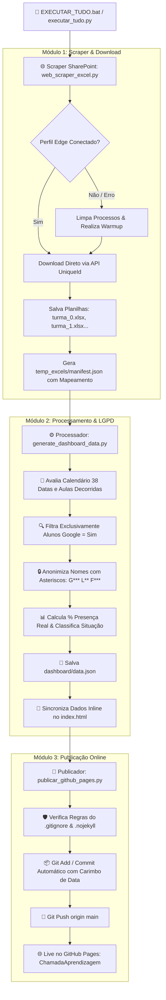
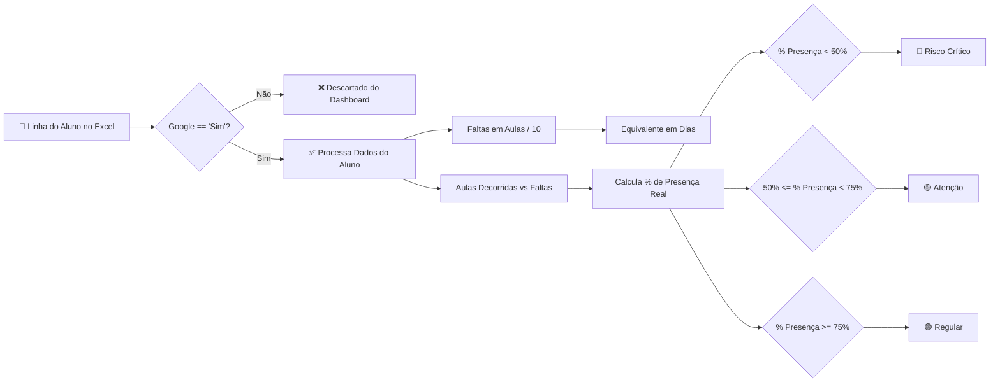

# 🎓 Dashboard Acadêmico de Acompanhamento de Frequência

Sistema automatizado de monitoramento acadêmico de frequência, pontualidade e ausências por turmas, integrado ao **SharePoint** e publicado automaticamente no **GitHub Pages** com interface responsiva no padrão **Google Light Theme**.

---

## 📊 Arquitetura do Fluxo de Dados (Mermaid)

### 1. Fluxo de Execução End-to-End



---

### 2. Regras de Negócio & Cálculo de Frequência



---

## 🛠️ Estrutura dos Arquivos do Projeto

```text
Dashboard chamada Google/
├── 📄 EXECUTAR_TUDO.bat           # Atalho de 1 clique para execução no Windows
├── 🐍 executar_tudo.py            # Orquestrador principal da automação
├── 🐍 web_scraper_excel.py        # Módulo de download direto de planilhas do SharePoint
├── 🐍 generate_dashboard_data.py   # Processador de dados, LGPD (asteriscos) e regras
├── 🐍 publicar_github_pages.py    # Publicador automático para o GitHub Pages
├── ⚙️ config.json                 # Configuração de URLs das turmas e calendário
├── 🎨 index.html                  # Painel Web Responsivo (Google Light Theme)
├── 🔒 .gitignore                  # Bloqueio de arquivos sigilosos (cookies/perfis)
├── 🚫 .nojekyll                   # Flag de desativação do Jekyll no GitHub Pages
├── 📦 requirements.txt            # Dependências Python (Playwright, Pandas, Openpyxl)
├── 📁 dashboard/
│   └── 📄 data.json               # Dados processados para o Dashboard
└── 📁 temp_excels/                # Cache local temporário das planilhas baixadas
```

---

## ⚙️ Regras de Negócio

- **Carga Horária Total**: 400 Aulas (40 Dias).
- **Proporção**: 1 Dia de Aula = 10 Aulas.
- **Limite de Reprovação por Ausência**: 100 Aulas (10 Dias).
- **Calendário do Curso**: 38 datas oficiais pré-configuradas no `config.json`.
- **Filtro de Alunos**: Apenas alunos com a coluna `Google == 'Sim'` são incluídos.
- **Anonimização (LGPD)**: Os nomes dos alunos são mascarados exibindo as primeiras 2 a 3 letras seguidas de asteriscos (`*`) (ex: `GIU*** LU* FA*** DA CR**`).
- **Classificação por Presença**:
  - 🟢 **Regular**: Presença `≥ 75%`.
  - 🟡 **Atenção**: Presença entre `50%` e `74.9%`.
  - 🔴 **Risco Crítico**: Presença `< 50%`.

---

## 🚀 Como Executar

### Opção 1: Clique Único (Windows)
Dê um duplo clique no arquivo `EXECUTAR_TUDO.bat`.

### Opção 2: Linha de Comando (Terminal)
```bash
python executar_tudo.py
```

O script orquestrador irá:
1. Baixar as planilhas atualizadas do SharePoint.
2. Processar todas as turmas e aplicar a anonimização com asteriscos.
3. Sincronizar os dados inline no `index.html`.
4. Comitar e publicar automaticamente no GitHub Pages.

---

## 🌐 Endereço da Aplicação Online
👉 **[https://marcaumdev.github.io/ChamadaAprendizagem/](https://marcaumdev.github.io/ChamadaAprendizagem/)**
